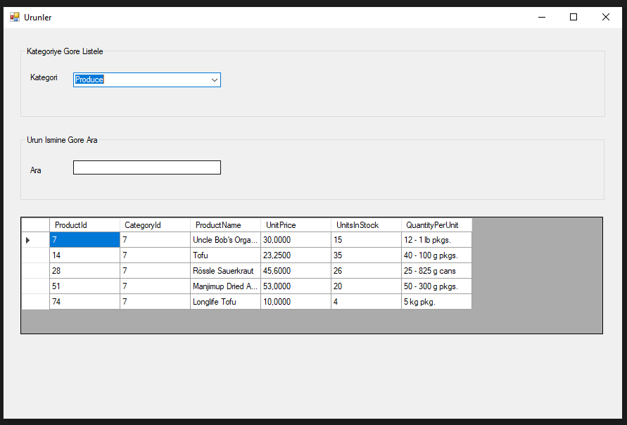
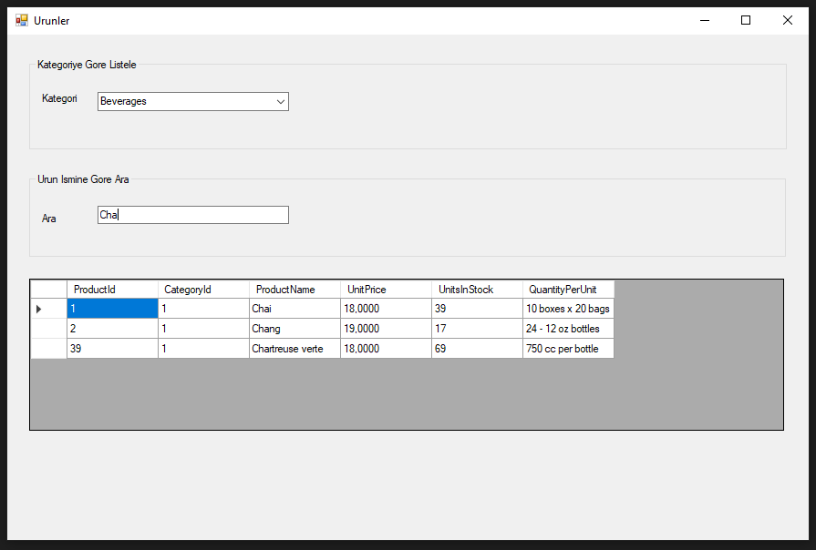

# A Basic Recap Windows Forms Project

-   The Northwind sample database has been used.
-   Basic category filter and product search have been done.
-   The main aim of this project is to get used to with entity framework and its features.

Filter by category:

Search by product name:

